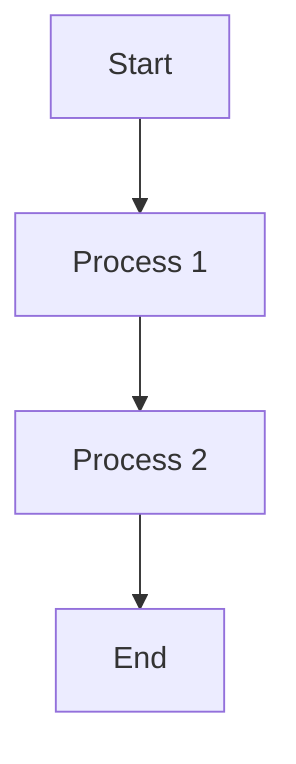

# Node.js-hello-world

This repository contains a Node.js "Hello World" application with deployment configurations for Docker and Kubernetes using Jenkins.

```mermaid
flowchart TD;
    A[Start] --> B[Process 1];
    B --> C[Process 2];
    C --> D[End];
```
